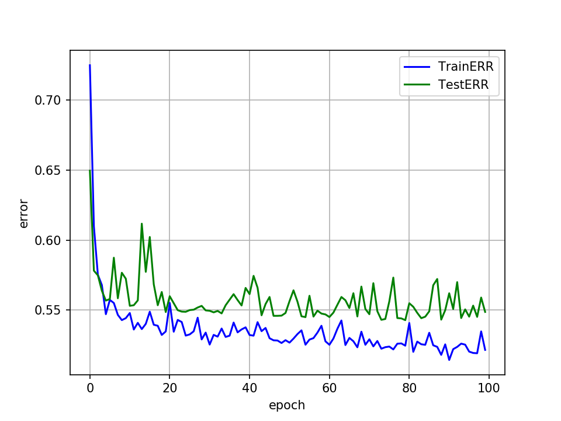

# Overall survival prediction of non-small cell lung cancer by integrating microarray and clinical data with deep learning
This repository provides a reference implementation of *Bimodal DNN* as described in the paper submitted to *Scientific Reports*: *Overall survival prediction of non-small cell lung cancer by integrating microarray and clinical data with deep learning*.

## Prognostic biomarker selection
The built gene interaction networks based on microarray data. Based on our previous research, we selected 7 prognostic biomarkers with high prognsotic relevance values (PRV) and combined with 8 eight well-known biomarkers to form a set of 15 prognostic biomarkers for NSCLC patient overall survival prediction. Their interactions are illustrated with the following figure generated with [STRING](https://string-db.org/):
<div align="center">
  
</div>

## *Bimodal DNN* model architecture
The *Bimodal DNN* consists of two subnetworks for microarray and clincial data, as well as a merge subnetwork. The two subnetworks were first pre-trained with microarray and clinical data, respectively. They were then merged with the merge ubnetwork to obtain the final prediction. The detailed model architecture is illustrated in the following figure and more details can be found in the submitted paper.
<div align="center">
  </img>
</div>

## Basic usage
### Data availability
The combined GSE cohort is available [here](https://drive.google.com/file/d/1dnqQEahODuZpFPiIaZO86ucFRcGuFgAA/view?usp=sharing). The data were first pre-processed and split into train/test splits.

### Examples
You can train the microarray/clinical subnetworks with the following lines. Trained model and its details are saved in */models*.
```python
python3 pretrain_x.py
python3 pretrain_c.py
```
After pre-training, the merged *Bimodal DNN* can be trained with
```python
python3 merge.py
```
### Results
<div>
  <figure>
  
  <figcaption><center>Loss per epoch for the microarray subnetwork.</center></figcaption>
  </figure>
</div>
<div>
  <figure>
  
  <figcaption><center>Loss per epoch for the clinical subnetwork.</center></figcaption>
  </figure>
</div>
<div>
  <figure>
  
  <figcaption><center>Loss per epoch for the merge network.</center></figcaption>
  </figure>
</div>

## Citation
If you find our work useful for your research, please consider citing our work. Please feel free to [contact](http://cc.ee.ntu.edu.tw/~chelin/) us. A pre-print version of our [paper](https://www.biorxiv.org/content/10.1101/656140v2) is available on bioRxiv.

